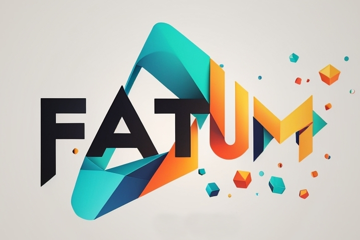

# fatum-vscode

This extention will help you to prettify and manage json logs

[![CodeFactor][codefactor-badge]][codefactor-url]
[![SonarCloud][sonarcloud-badge]][sonarcloud-url]
[![Codacy][codacy-badge]][codacy-url]
[![Scrutinizer][scrutinizer-badge]][scrutinizer-url]

[![Build Status][tests-badge]][tests-url]
[![Commit activity][commit-activity-badge]][github]
[![FOSSA][fossa-badge]][fossa-url]
[![License][badge-lic]][github]
[![Made in Ukraine][ukr-badge]][ukr-link]

## 🇺🇦 Help Ukraine
I woke up on my 26th birthday at 5 am from the blows of russian missiles. They attacked the city of Kyiv, where I live, as well as the cities in which my family and friends live. Now my country is a war zone. 

We fight for democratic values, freedom, for our future! Once again Ukrainians have to stand against evil, terror, against genocide. The outcome of this war will determine what path human history is taking from now on.

💛💙  Help Ukraine! We need your support! There are [dozen ways][ukr-link] to help us, just do it!

## Table of Contents
- [fatum-vscode](#fatum-vscode)
  - [🇺🇦 Help Ukraine](#-help-ukraine)
  - [Table of Contents](#table-of-contents)
  - [Usage](#usage)
  - [Contribute](#contribute)

## Usage

## Contribute

Make the changes to the code and tests. Then commit to your branch. Be sure to follow the commit message conventions. Read [Contributing Guidelines](.github/CONTRIBUTING.md) for details.

[github]: https://github.com/pustovitDmytro/fatum-vscode
[coveralls]: https://coveralls.io/github/pustovitDmytro/fatum-vscode?branch=master
[badge-deps]: https://img.shields.io/david/pustovitDmytro/fatum-vscode.svg
[badge-lic]: https://img.shields.io/github/license/pustovitDmytro/fatum-vscode.svg
[badge-coverage]: https://coveralls.io/repos/github/pustovitDmytro/fatum-vscode/badge.svg?branch=master
[url-coverage]: https://coveralls.io/github/pustovitDmytro/fatum-vscode?branch=master

[tests-badge]: https://img.shields.io/circleci/build/github/pustovitDmytro/fatum-vscode
[tests-url]: https://app.circleci.com/pipelines/github/pustovitDmytro/fatum-vscode

[codefactor-badge]: https://www.codefactor.io/repository/github/pustovitdmytro/fatum-vscode/badge
[codefactor-url]: https://www.codefactor.io/repository/github/pustovitdmytro/fatum-vscode

[commit-activity-badge]: https://img.shields.io/github/commit-activity/m/pustovitDmytro/fatum-vscode

[scrutinizer-badge]: https://scrutinizer-ci.com/g/pustovitDmytro/fatum-vscode/badges/quality-score.png?b=master
[scrutinizer-url]: https://scrutinizer-ci.com/g/pustovitDmytro/fatum-vscode/?branch=master

[lgtm-lg-badge]: https://img.shields.io/lgtm/grade/javascript/g/pustovitDmytro/fatum-vscode.svg?logo=lgtm&logoWidth=18
[lgtm-lg-url]: https://lgtm.com/projects/g/pustovitDmytro/fatum-vscode/context:javascript

[codacy-badge]: https://app.codacy.com/project/badge/Grade/8667aa23afaa4725854f098c4b5e8890
[codacy-url]: https://www.codacy.com/gh/pustovitDmytro/fatum-vscode/dashboard?utm_source=github.com&amp;utm_medium=referral&amp;utm_content=pustovitDmytro/fatum-vscode&amp;utm_campaign=Badge_Grade

[sonarcloud-badge]: https://sonarcloud.io/api/project_badges/measure?project=pustovitDmytro_fatum-vscode&metric=alert_status
[sonarcloud-url]: https://sonarcloud.io/dashboard?id=pustovitDmytro_fatum-vscode

[node-ver-test-badge]: https://github.com/pustovitDmytro/fatum-vscode/actions/workflows/npt.yml/badge.svg?branch=master
[node-ver-test-url]: https://github.com/pustovitDmytro/fatum-vscode/actions?query=workflow%3A%22Node.js+versions%22

[fossa-badge]: https://app.fossa.io/api/projects/custom%2B24828%2Ffatum-vscode.svg?type=shield
[fossa-url]: https://app.fossa.io/projects/custom%2B24828%2Ffatum-vscode?ref=badge_shield

[ukr-badge]: https://img.shields.io/badge/made_in-ukraine-ffd700.svg?labelColor=0057b7
[ukr-link]: https://war.ukraine.ua